# Safex -A safety Purpose App
You can create group like of your family, and each one in the group can see other members location.
You can create as many groups you like as of now.

    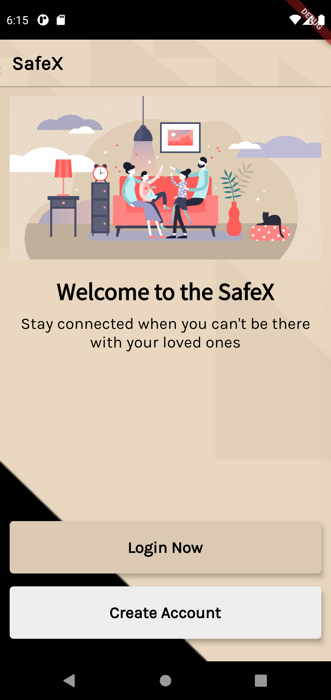
    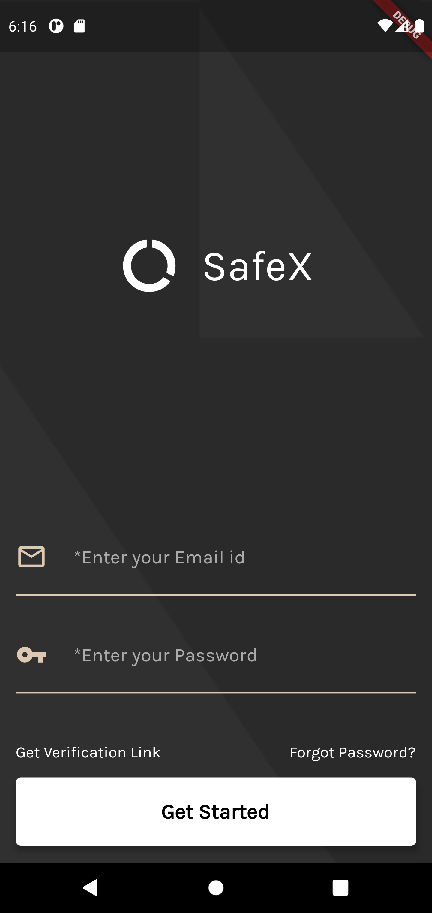
    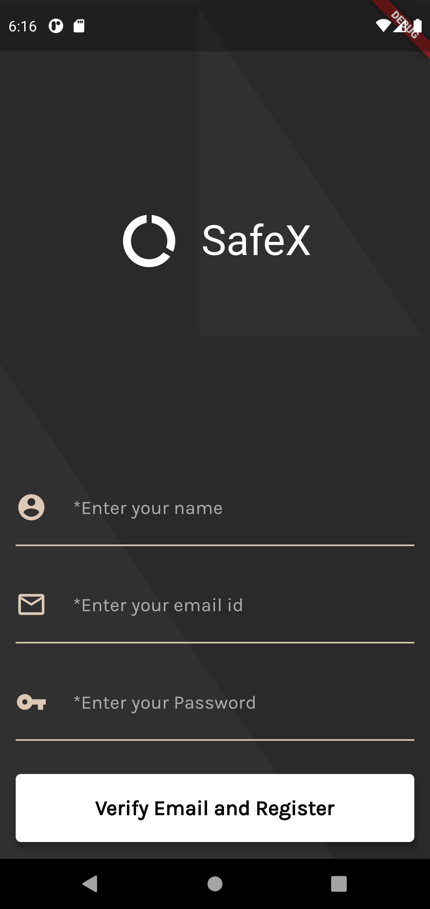 
    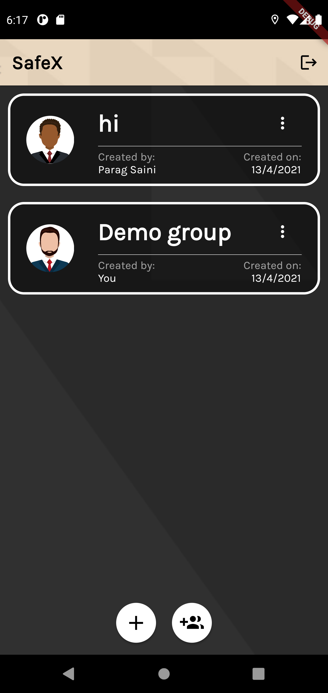
    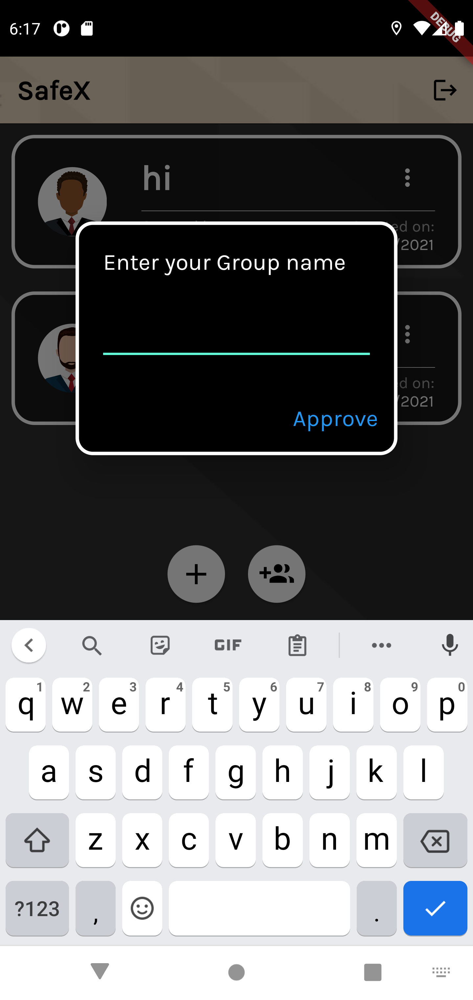
    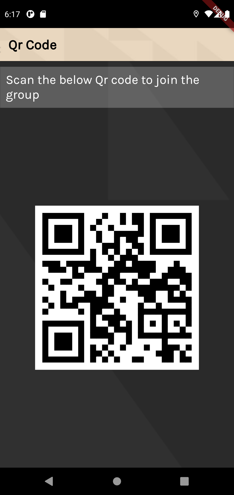
    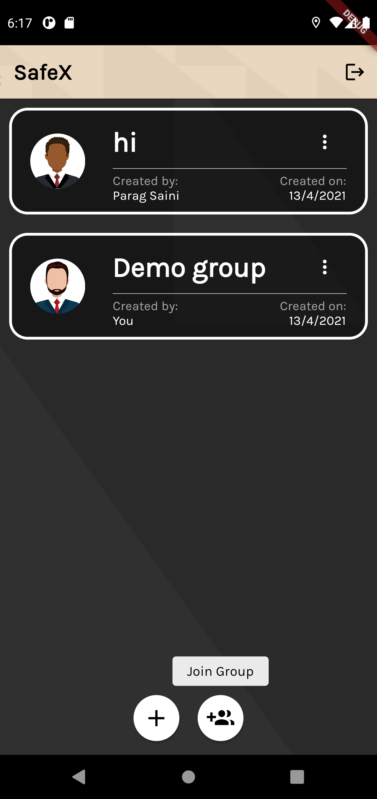
    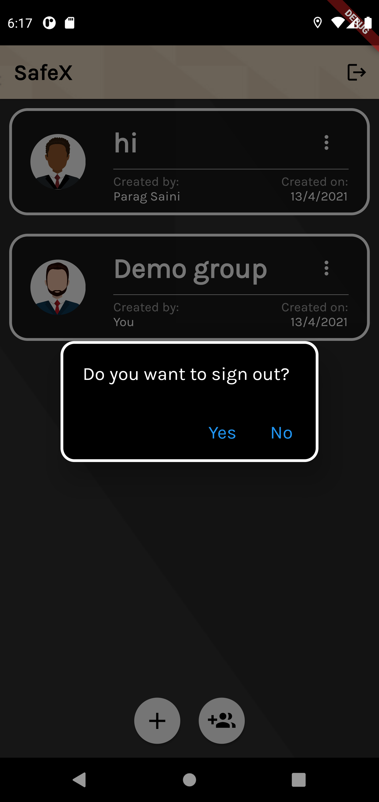
    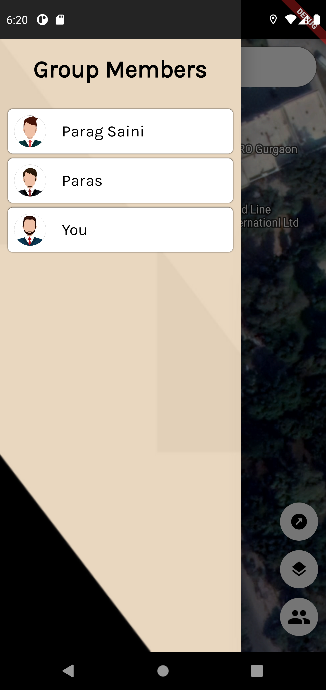
    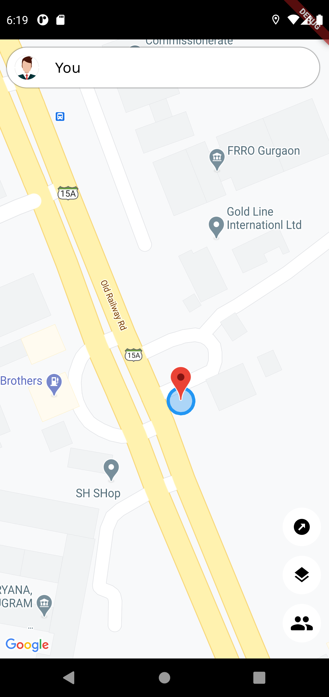
    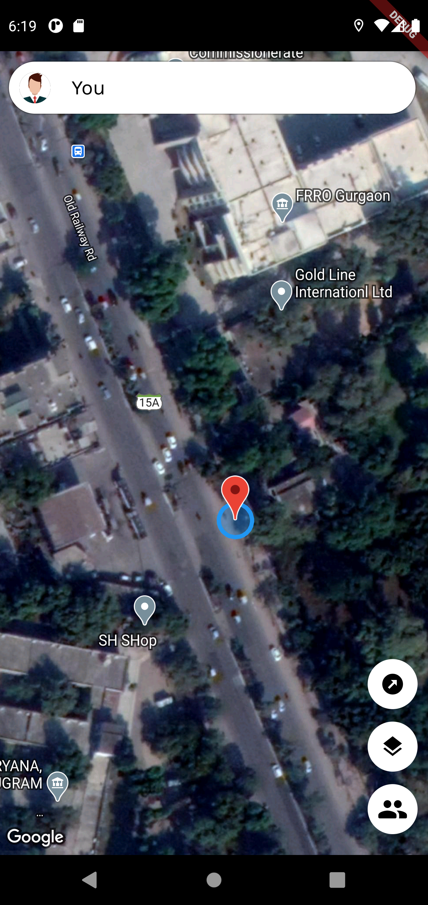 
    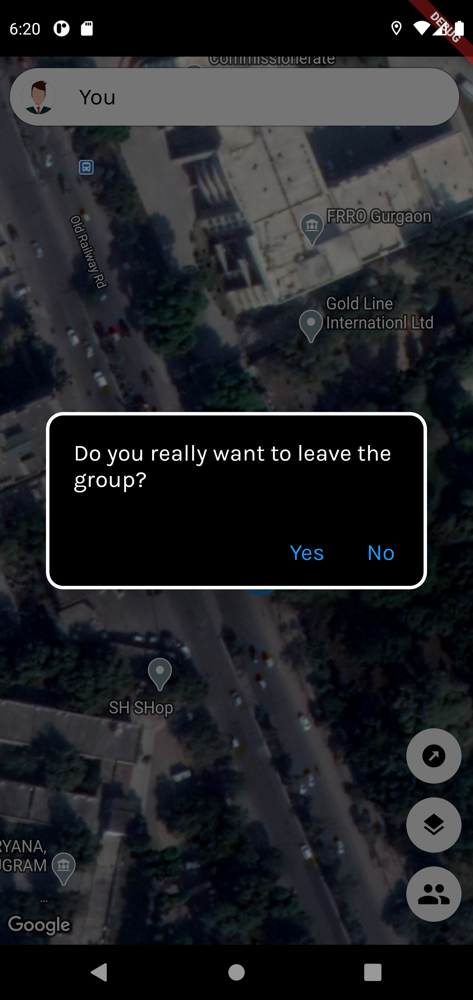
